# FileVault

**FileVault** is a secure, self-hosted file storage web application. Upload, organise, preview and download your files through a desktop-style interface, with every file encrypted on disk. Designed as a portfolio project to showcase full-stack development skills.

## Features

**Files**
- Upload, download (single files or zips), rename, move, copy and delete files and folders
- Big files upload in 8 MB chunks that resume after a dropped connection (up to 2 GB each by default); whole folders can be uploaded too
- Desktop-style file and folder icons, image thumbnails, grid and list views, sortable columns
- Details pane with name, type, size, created/modified dates and a preview (images, video, audio, PDF and text)
- Search every file and folder by name from the top bar
- Favourites and recently opened files at the top of the folder tree
- Recycle bin: deleted items can be restored, and are removed for good after 30 days
- A name that's already taken gets a number, like Windows Explorer: `report (1).pdf`
- New accounts start with Documents, Pictures, Music and Videos folders
- Works on phones and tablets: the folder tree becomes a drawer and the details pane a bottom sheet

**Sharing**
- Share links to a file or folder, with an optional expiry date and password; folders download as a zip
- A Shared links page to copy links, show their passwords again and revoke them

**Security**
- Files encrypted at rest with AES-256-GCM, each with its own key; share link secrets and authenticator keys are encrypted too
- Two-factor authentication with an authenticator app, plus single-use recovery codes
- See every device you're logged in on, and sign any of them out
- Email confirmation before the first login, and password reset by email
- Short-lived access tokens with a rotating, httpOnly refresh-token cookie
- Password rules, rate limiting and per-user storage quotas
- Strict Content-Security-Policy and security headers; ready to run behind an HTTPS reverse proxy

**Account and appearance**
- Log in with email; first and last name, profile picture, password change, account deletion
- Changing your email address needs your password and is confirmed by a link sent to the new address (open it while signed in); until then the current address stays your login, and the old address (if confirmed) gets a "wasn't me" link that cancels the change and signs out every device
- Light, dark and system themes, and a choice of accent colour
- An admin page for the server owner: every account's avatar, storage use and quota, each user's last login IP address and country (looked up in a local database, nothing sent to a third party), and server totals; create accounts (active immediately, email confirmed), set a user's password (signs them out everywhere), mark non-admin accounts permanent (admins are always permanent), suspend and unsuspend accounts (a suspended user is signed out at once and can't sign in; files and shares are kept, share links show "not found" until unsuspended), and delete accounts (type the email to confirm; the last admin can't be deleted)
- Optional hosted mode (`FILEVAULT_MODE=hosted`) for a public instance: accounts unused for 30 days are removed with their files (after a warning email when SMTP is set up), and new users see a dismissible notice. Administrator, permanent and suspended accounts are never removed. Self-hosted is the default and removes nothing

**Tooling**
- Interactive API docs (Swagger) at `/swagger` in development, or with `SWAGGER_ENABLED=true`
- Desktop app (Electron) for Windows, macOS and Linux
- Runs with one command using Docker Compose
- CI on every push: backend build and integration tests, frontend lint and tests (Vitest), Docker images

## Screenshots

The file manager, with Favourites and Recent above the folder tree and thumbnails for images:

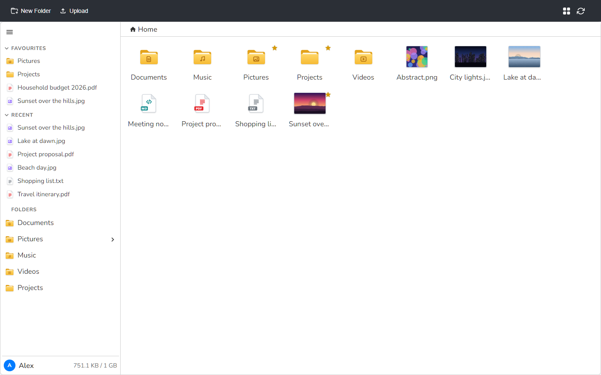

The same view in the dark theme:

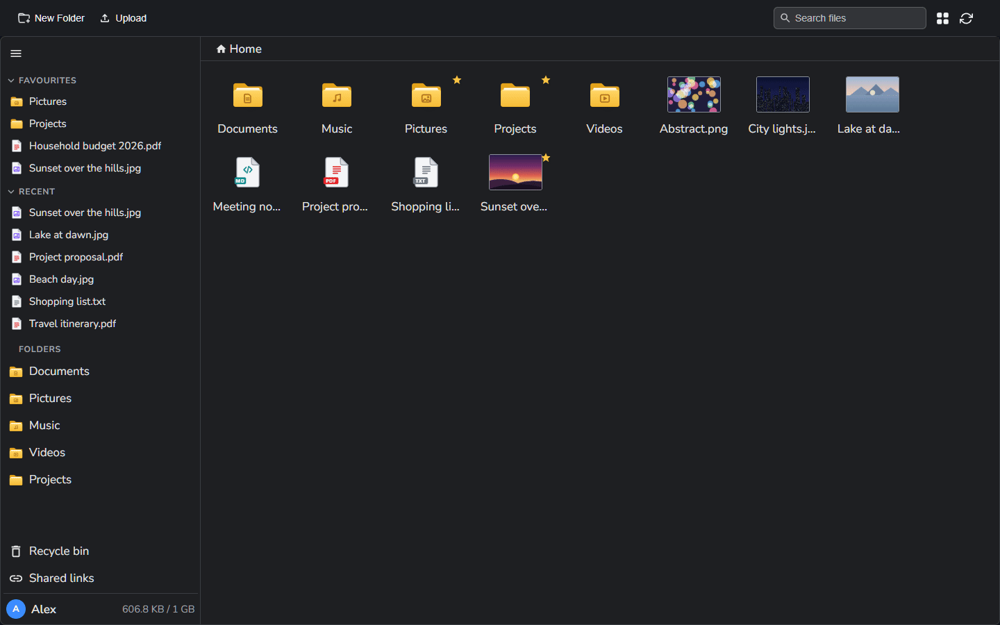

Selecting a file shows its details and a preview on the right:

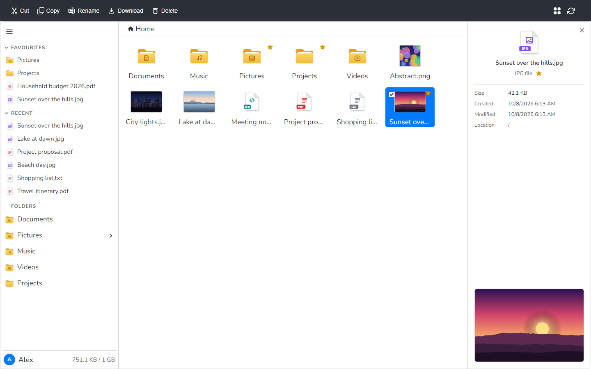

List view, with sortable columns and a star to add items to Favourites:

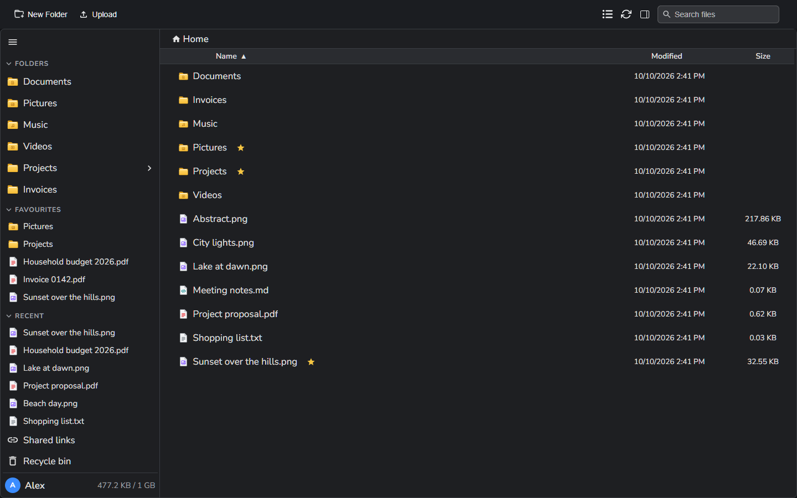

Searching every folder from the top bar, and the recycle bin:

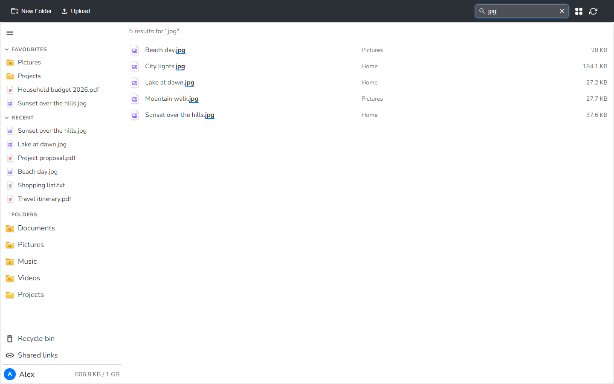

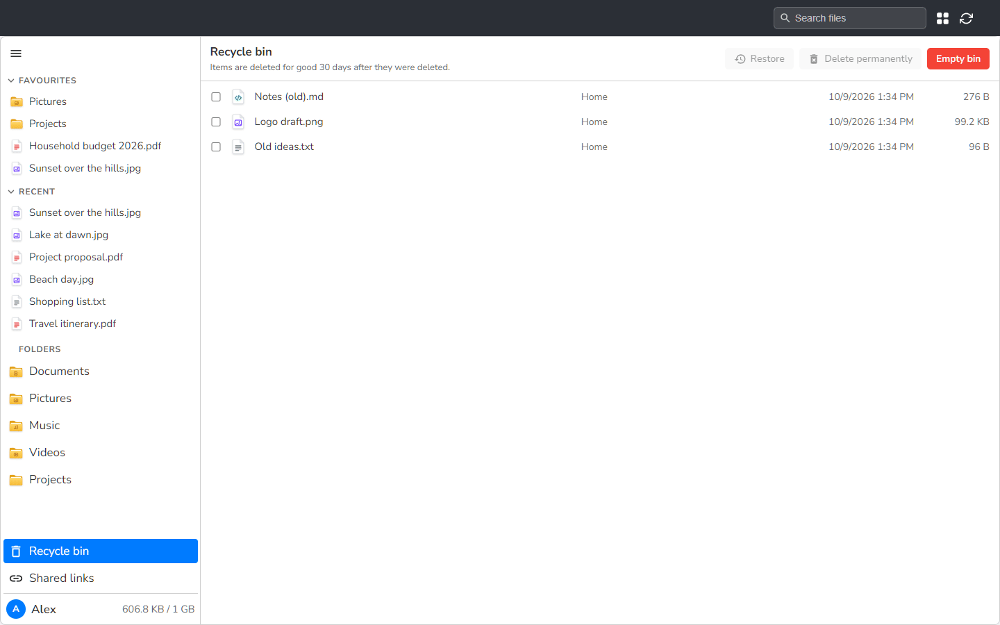

Share links: the Shared links page, where a link's password can be shown again, and what someone opening a folder link sees:

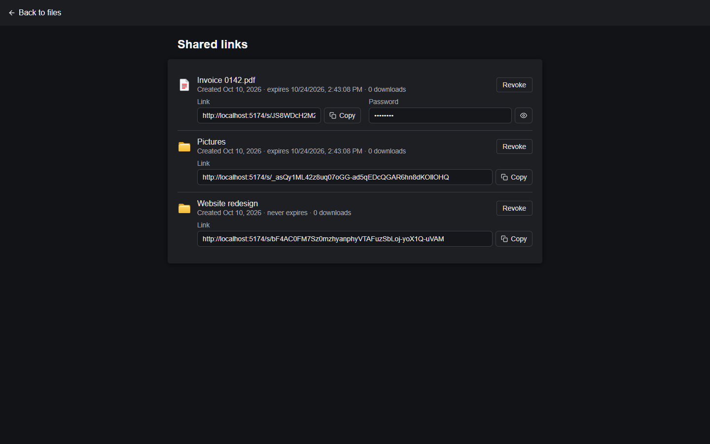

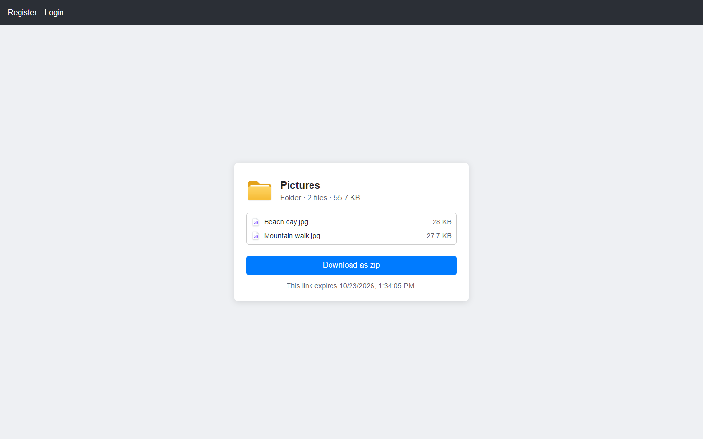

Logging in, and the Settings page (storage, theme and accent colour, profile; two-factor authentication and the devices you're logged in on):

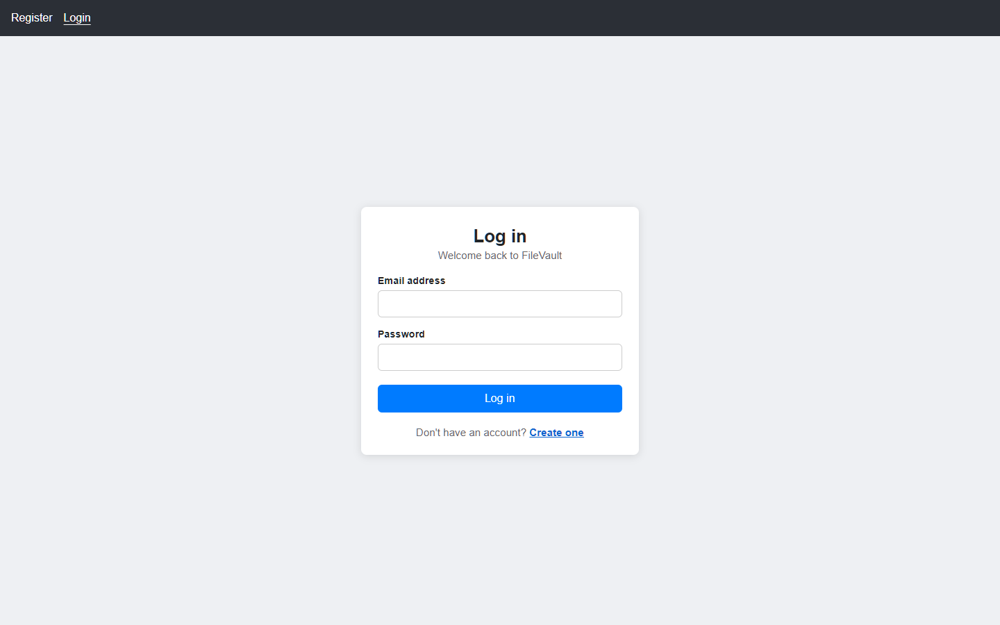

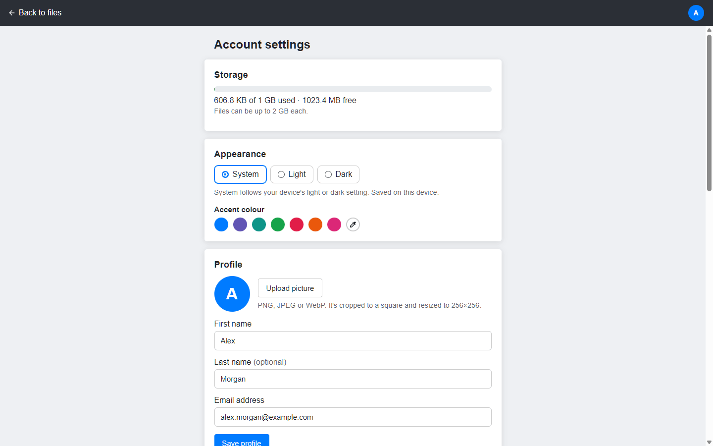

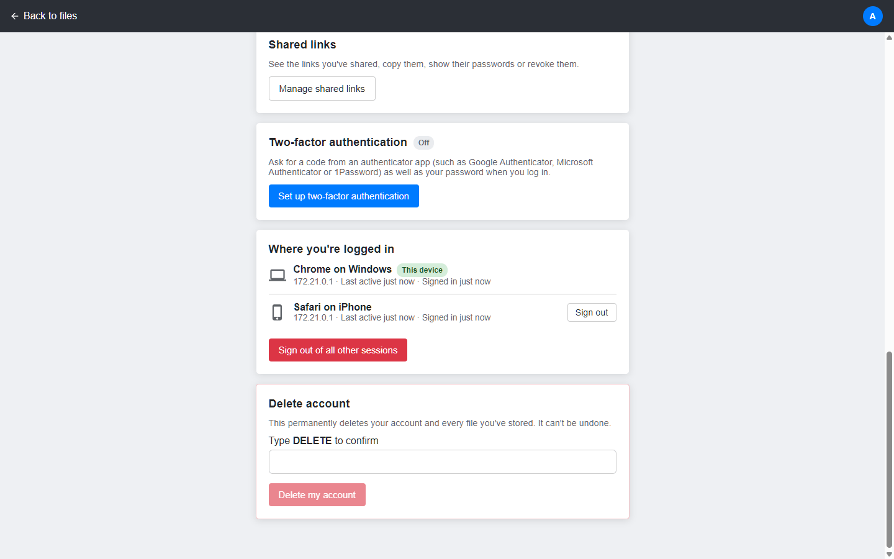

The admin page, for the server owner:

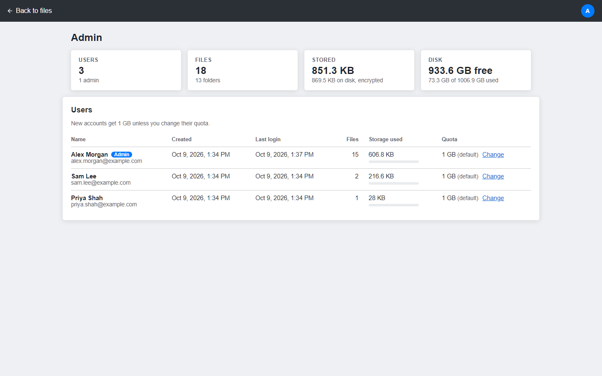

On a phone, the folder tree opens as a drawer and the less-used toolbar actions move into a menu:

<p>
  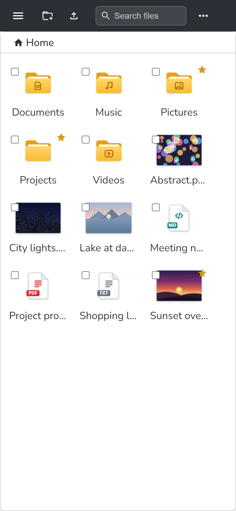
  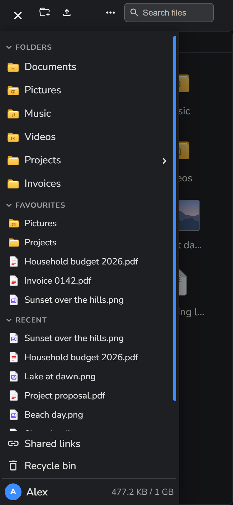
</p>

## Technologies Used

- **Backend**: C# (.NET 8 Minimal APIs), ADO.NET
- **Database**: SQL Server
- **Frontend**: React 18 (Vite)
- **Desktop**: Electron
- **Storage**: Filesystem-based storage, encrypted
- **Containerization**: Docker + Docker Compose

## Run everything with Docker

Only [Docker](https://www.docker.com/) is needed for this option.

```bash
git clone https://github.com/ChrisLPJones/FileVault.git
cd FileVault
cp .env.example .env      # fill in MSSQL_SA_PASSWORD, JWT_KEY and ENCRYPTION_MASTER_KEY
docker compose up --build
```

Then open http://localhost:5173 (the API is on http://localhost:3000). Compose starts SQL Server, waits for it to be healthy, applies `Backend/Docker/db/init.sql`, then starts the API and the nginx-served frontend. The database isn't exposed outside the Docker network.

`init.sql` runs on every start and only adds what's missing, so pulling new code and running `docker compose up --build -d` also upgrades an existing database.

Data lives in two named volumes, `filevault_sql_data` and `filevault_file_storage` (the encrypted files). Back both up together with `ENCRYPTION_MASTER_KEY`. `docker compose down` keeps them; `docker compose down -v` deletes them.

To open the database in a GUI tool (SSMS, Azure Data Studio, VS Code SQLTools), copy `docker-compose.override.example.yml` to `docker-compose.override.yml` and restart with `docker compose up -d`. SQL Server is then reachable from this machine only at `127.0.0.1,1434`, user `sa`, with `MSSQL_SA_PASSWORD` from `.env`. Use `127.0.0.1` rather than `localhost`, which some tools resolve to IPv6 and then time out. To look at the stored files, run `docker compose exec api ls -l /data/storage`. They are encrypted, so download them through the app to read them.

New accounts confirm their email address before they can log in, and "Forgot password?" sends a reset link. To send those emails, set the `SMTP_*` settings in `.env`. Without them the API writes each email, link included, to its log instead, so on a local setup you can find the link with `docker compose logs api`.

The first account registered on a new install becomes the administrator and gets an Admin link in the account menu (`/admin`: every account's storage use and quota, server totals, and who else is an administrator). On a public install, register straight after the first start, or set `INITIAL_ADMIN_EMAIL` in `.env` to your address so only that account can become the administrator, once its email is confirmed (see [docs/DEPLOYMENT.md](docs/DEPLOYMENT.md)). Admin rights are chosen only when an administrator creates an account (Administrator tick box); there is always at least one administrator.

The frontend bundle has the API URL compiled in. If the browser reaches the API somewhere other than `http://localhost:3000`, set `API_URL` (and `FRONTEND_URL` for CORS) in `.env` and rebuild.

The Admin page can show the country of each user's last login. That needs a free MaxMind GeoLite2 Country database, which Compose can download for you with `docker compose --profile geoip up -d` once `GEOIPUPDATE_ACCOUNT_ID` and `GEOIPUPDATE_LICENSE_KEY` are set in `.env`. Without it the country shows "Unknown". See [docs/DEPLOYMENT.md](docs/DEPLOYMENT.md#8-last-login-location-geoip).

To run a public instance that cleans up unused accounts, set `FILEVAULT_MODE=hosted` in `.env`, and optionally `HOSTED_CONTACT_EMAIL` (the address the notice tells users to email to ask for a permanent account). Anything other than `self-hosted` or `hosted` stops the API starting. See "Hosted mode" in [docs/DEPLOYMENT.md](docs/DEPLOYMENT.md).

Hosting it for real (HTTPS reverse proxy, secrets, backups, key rotation, security headers): see [docs/DEPLOYMENT.md](docs/DEPLOYMENT.md).

## Local development

### Prerequisites

- [.NET 8 SDK](https://dotnet.microsoft.com/)
- [Docker](https://www.docker.com/) (for SQL Server)
- [Node.js](https://nodejs.org/) 20 or later

### Configure secrets

Secrets are not committed. Create these gitignored files from the templates:

```bash
# SQL Server SA password used by Docker
cp Backend/Docker/.env.example Backend/Docker/.env

# API connection string, JWT signing key and file encryption key
cp Backend/appsettings.Development.example.json Backend/appsettings.Development.json

# Where the frontend finds the API
cp Frontend/.env.example Frontend/.env
```

Then edit them:

- Set `MSSQL_SA_PASSWORD` in `Backend/Docker/.env` to a strong password.
- In `Backend/appsettings.Development.json`, use that same password in the connection string.
- Set `Jwt:Key` to a random value of at least 32 bytes (e.g. `openssl rand -base64 48`).
- Set `Encryption:MasterKey` to a base64-encoded 32-byte key (e.g. `openssl rand -base64 32`). **Back this key up.** Every stored file is encrypted with a key that is itself encrypted with this one, so losing it means losing every file.
- Point `VITE_API_BASE_URL` in `Frontend/.env` at the API (the port `dotnet run` prints).

Outside Development, supply the same settings as environment variables (`ConnectionStrings__DefaultConnection`, `Jwt__Key`, `Encryption__MasterKey`). The API refuses to start if any of them is missing.

### Start it (three terminals)

```bash
# 1. SQL Server (Docker Desktop must be running). Also applies init.sql.
cd Backend/Docker
docker compose up -d

# 2. API
cd Backend
dotnet run

# 3. Frontend
cd Frontend
npm install
npm run dev
```

### Tests

```bash
dotnet test                     # backend integration tests (needs the SQL Server from step 1)
cd Frontend
npm run lint                    # frontend lint
npm test                        # frontend tests (Vitest and Testing Library)
```

The integration tests create their own throwaway accounts and delete them afterwards. If tests fail with server errors after pulling new code, re-run `docker compose up -d` in `Backend/Docker` to apply any new database changes.

### How files are stored

Uploaded files are encrypted with AES-256-GCM before they reach disk (`Backend/SecureVaultStorage`, named by GUID). Each file has its own random data key, stored in the database encrypted with the master key. Files are encrypted in 64 KB chunks, so downloads stream without loading the whole file into memory and range requests (e.g. video seeking) still work. A file that has been modified on disk fails to decrypt instead of being served.

## Desktop app

`Desktop/` contains an Electron app that opens your FileVault server in its own window, with a
first-run "connect to server" screen, a remembered window position and an installer build:

```bash
cd Desktop
npm install
npm start          # run it
npm run dist       # build the Windows installer (dist/FileVault Setup <version>.exe)
```

See [Desktop/README.md](Desktop/README.md) for details.

## API Documentation

Interactive API docs are served at `/swagger` on the API, and the OpenAPI document is at `/swagger/v1/swagger.json` (it can be imported into Postman or Insomnia). They're on when the API runs in Development (`dotnet run`). The Docker stack runs in Production, where they're off unless you add `SWAGGER_ENABLED=true` to `.env` (then **http://localhost:3000/swagger**); see [docs/DEPLOYMENT.md](docs/DEPLOYMENT.md#5-api-docs-swagger).

To try protected endpoints, call `POST /user/login`, then click **Authorize** and paste the returned access token (it lasts 15 minutes). Endpoints are grouped as:

- **Account**: register, login, refresh, logout, profile, password, avatar, email confirmation, password reset, storage usage, delete account
- **Two-factor authentication**: set up, turn on and off, log in with a code, new recovery codes
- **Sessions**: list the devices you're logged in on, sign one or all others out
- **Files**: upload, folders, list, download (single file or zip), rename, move, copy, delete, thumbnails, favourites, recently opened
- **Uploads**: chunked, resumable uploads for big files
- **Recycle bin**: list, restore, delete for good, empty
- **Shares**: create, list and revoke share links, and the public endpoints a link uses
- **Admin**: every account's usage and quota, change quotas, create accounts (optionally as an administrator, with an optional quota), delete accounts, set a user's password, mark non-admin accounts permanent (admins are always permanent), suspend or unsuspend accounts (`PUT /admin/users/{id}/suspended`), server totals
- **Health**: `/ping` and `/pingsql`

## Project layout

| Folder | Contents |
|---|---|
| `Backend/` | .NET 8 API: routes, services, models, `Docker/` (dev SQL Server and `init.sql`) |
| `Backend.Test/` | xUnit integration tests |
| `Frontend/` | React app and its Vitest tests; the file manager UI is in `src/FileManager` ([credits](Frontend/src/FileManager/README.md)) |
| `Desktop/` | Electron desktop app |
| `docs/` | [Deployment guide](docs/DEPLOYMENT.md) and screenshots |

## License

This project is licensed under the [MIT License](LICENSE). The file manager UI is adapted from
[@cubone/react-file-manager](https://github.com/Saifullah-dev/react-file-manager), also MIT licensed.

This product includes GeoLite2 data created by MaxMind, available from https://www.maxmind.com

## Author

Christian Jones
[GitHub](https://github.com/ChrisLPJones)
